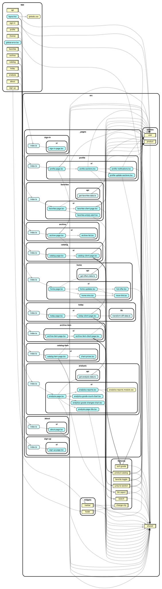

[Русский](./README.md) | English

# Dns-markdown service

## Site URL

https://dns.ebulgakov.com/

## About

This is an unofficial website related to the DNS company. It helps you browse discounted items from different cities listed on the DNS website.

The service provides a convenient way to view products from Samara for now. You can add items to your favorites to keep track of updates, such as price changes or product availability in stores.

## Getting Started

First, run the development server:

```bash
pnpm dev
```

Open [http://localhost:3000](http://localhost:3000) with your browser to see the local site.

## .env file

Rename the `.env-example` file to `.env` and fill in the required variables.

## Storybook

Chromatic Storybook is set up for this project: https://www.chromatic.com/library?appId=695938b24c4c7f59436c970b

## Dependency graph

```bash
pnpm dep-check         # CI gate: no circular imports
pnpm dep-graph          # prints a Mermaid diagram to stdout — paste into a PR/Markdown
pnpm dep-graph:archi    # renders dependency-graph.svg (needs Graphviz's `dot` locally)
```

Requires Node `^22||^24||>=26` (dependency-cruiser's own supported range) — the project's pinned version ([`.nvmrc`](./.nvmrc), `v26.7.0`) already satisfies this. See `.dependency-cruiser.cjs` and `CLAUDE.md` for what these rules cover and why.



## Technologies

- Next.js 16
- Typescript
- Tailwind CSS
- Shadcn/UI
- I18n
- Storybook
- Playwright
- Jest
- Sentry
- Clerk Auth
